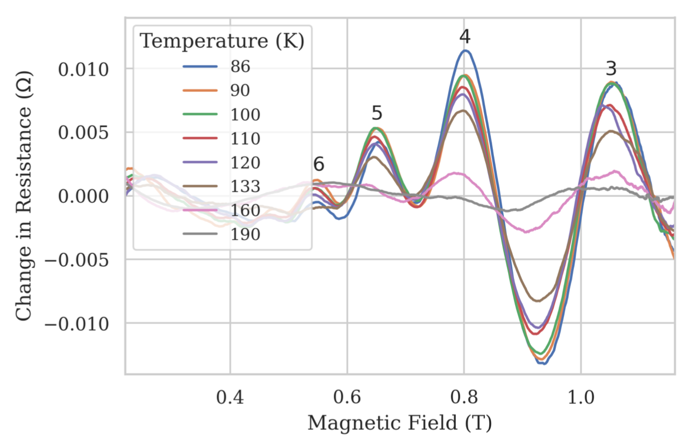
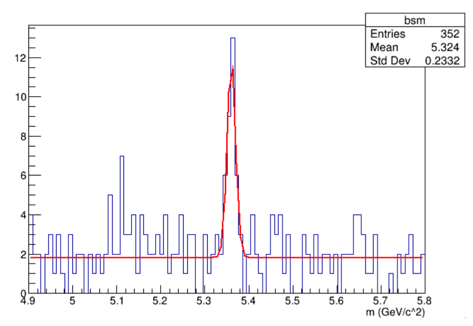
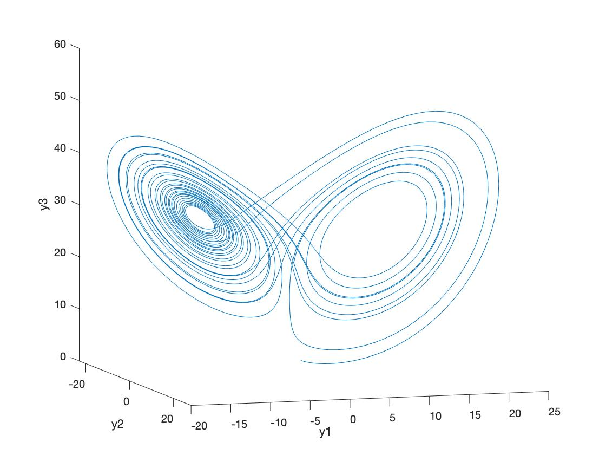
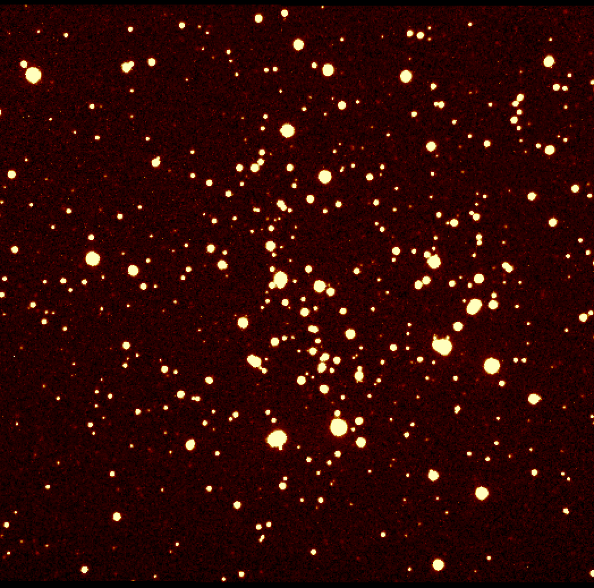

# Oxford Physics Labs
Series of physics-based data analysis projects, which I received a practical commendation for “excellence of laboratory practical work”.

## Projects include investigations into:

### The Magnetophonon Effect (Python, Jupyter Notebok)

### Superconductivity (Python, Jupyter Notebook)

### B Mesons (R, R Markdown)

### Chaos (MATLAB)

### Colour Magnitude Diagrams (R, R Markdown)

The setup instructions are found in the README in each individual project repository. Reports for each of the projects can be found on [my personal website](https://a5v.github.io/personal-website/projects/).