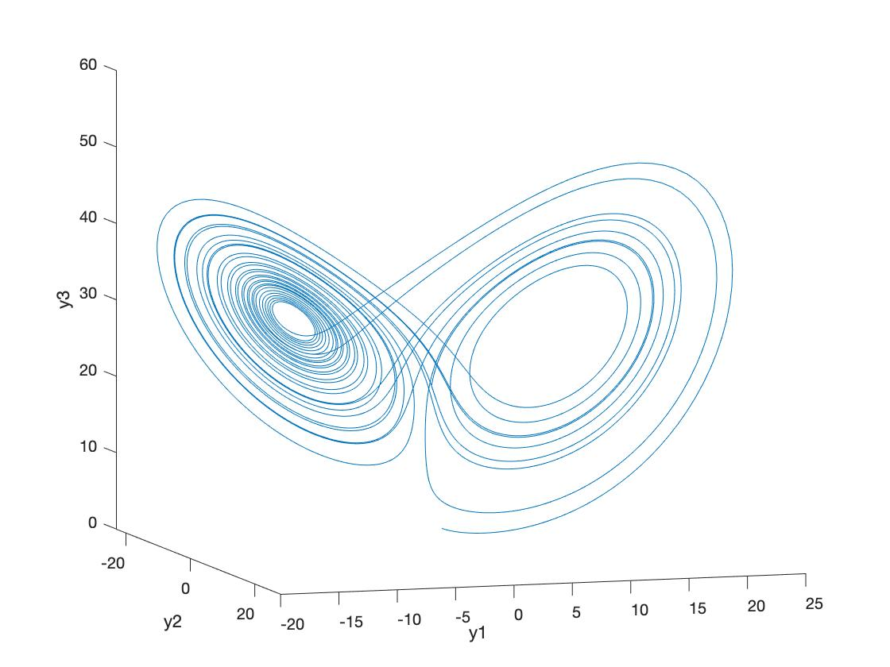

# Chaos

Project completed in December 2019

## lorentz_script.m

Fourth-order Runga-Kutta algorithm (ode_solve_rk.m) implemented to calculate solutions of the Lorentz system (solve_lorenz.m). Initial conditions and parameters for the Lorenz equations can be altered in this script.

See report for theory.
