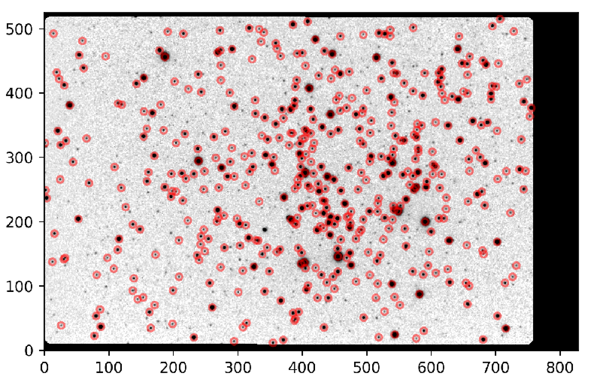
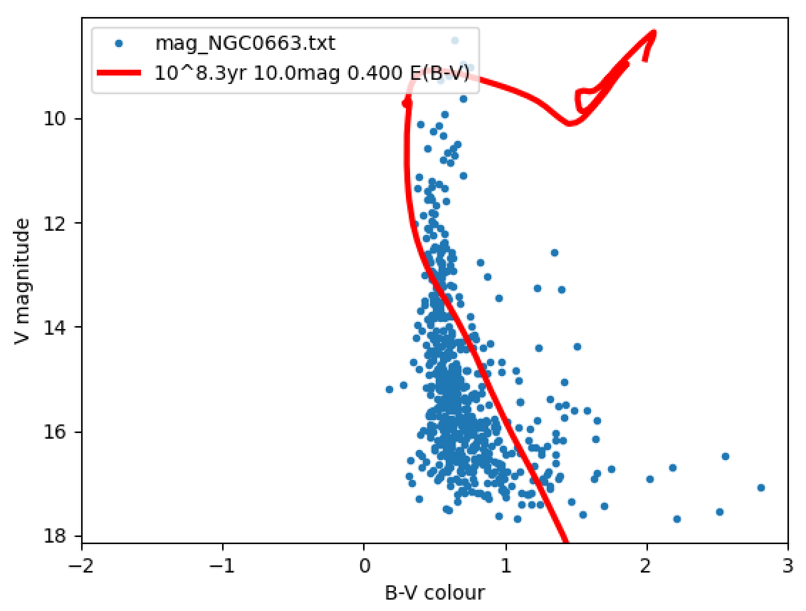

```{r setup, include=FALSE}
knitr::opts_chunk$set(echo = TRUE)
library(ggplot2)
```

# Introduction

Clusters are groups of stars that share a common origin. Although, they can have different masses, they will all have the same age. Young clusters allow astronomers to test theories of stellar birth while older clusters enable studies of the late stages of stellar evolution. There are two types of clusters: open/ galactic clusters and globular clusters.

A colour-magnitude diagram, in astronomy, is a graph showing the relation between the absolute magnitudes (brightnesses) of stars and their colours, which are closely related to their temperatures and spectral types. It is a form of Hertzsprung-Russell diagram (the nomenclature is not very well-defined).

Both a cluster’s age and its distance can be derived from such a colour-magnitude diagram. 

## Data

Data was collected from the Philip Wetton Telescope (PWT) in Oxford to study the colour-magnitude diagram (CMD) and density of open stellar clusters. The PWT is a 40cm diameter telescope installed in a dome on top of the Denys Wilkinson. We analyse the data for NGC0663, a young open cluster that has been observed with the PWT.

The 'raw' observation files are in FITS format, which is a universal data format used by virtually all observatories around the world. This set of images stored need spurious signals to be removed, to be calibrated and have brightness of the objects in the images measured.

# Calibrating the Images

We remove instrumental signature in three steps: bias subtraction, dark subtraction and flat field division.

* Dark frames are generated by taking observations with the camera shutter closed (any signal we see in the image is generated by the detector itself).
* Bias (aka Zero) frames are zero length dark frames and only contain the electronic offset applied by the camera electronics.

We create "master" calibration files from the raw calibration files.

## Bias Frames

The bias frames are almost uniform black images. Shown below is the first bias frame (Bias-S008-R002-C001-B2.fts) across a range of pixels using the z scale with DS9 (a visualisation software tool). We observe a slight gradient along the x-axis.

```{r echo=FALSE, out.width='50%'}

```

Plotting the mean bias as a function of x and y pixel respectively using plot bias.py script

```{r echo=FALSE, out.width='50%'}


```

The approximate bias level in the y-direction is 141.5 and the bias level in the x-direction stabilises at around 137.We observe that the bias in the y-direction is distributed around a constant value. This is expected. We observe that the bias in the x-direction decreases across the detector before leveling off at roughly the x-pixel 400. This is not expected (although we are able to see this behaviour from bias frame viewed with DS9). This could be due to imperfections in the detector.We focus on the region of the CCD detector where the bias is stable: $400<x<750, 0<y<500$

We increase the number of files used (from 1 to all 10) to calculate the mean bias value and standard deviation.

```{r bcd, echo=FALSE}
bcd <- read.csv("../data/bias_cumulative_data.csv")
library(knitr)
kable(bcd)
```


```{r bcd plot, echo = FALSE}
p1 <- ggplot(bcd, aes(y = Mean.Bias.Value, x = Number.of.Bias.Files)) +
  geom_line()
p1 + ggtitle("Mean Bias Value Over an Increasing Number of Files") +
  theme(plot.title = element_text(hjust = 0.5)) +
  theme(plot.margin = unit(c(1,1,3,1),"cm"))

```

### Key Formula

Mean
$\bar{x}=\frac{1}{N}\sum_{i=1}^N x_i$

Standard Deviation
$\sigma = \sqrt{\frac{1}{N-1}\sum_{i=1}^N(x_i-\bar{x})^2}$

Standard Error of the Mean
$\sigma_{\bar{x}} = \frac{\sigma}{\sqrt{N}}$

We note that for large N, $\sigma	\propto \frac{1}{\sqrt{N}}$

We fit a line $\sigma	= \frac{A}{\sqrt{N}}$, where $A$ is a constant, using an nls fitting. A more accurate fitting method could be done by redoing this plot to make the plot linear.


```{r bcd plot2, echo = FALSE}

n = bcd[,1]
m = bcd[,2]
s = bcd[,3]

plot(n, s, xlab = "Number of Bias Files", ylab="Standard Deviation", main="Standard Deviation of Master Bias as the Number of Files Increase")


fitmodel <- nls(s ~ A / sqrt(n),
    start=list(A=1))

predictedy = predict(fitmodel, list(n)) 
lines(n, predictedy, col="red")

summary(fitmodel)
```

We find mean value of $137.05 \pm 0.92$

Assuming:

* mean value is 137.05 
* A = 8.83
* bias level of the detector does not vary with time

We need approximately 170 bias frames to reduce the error to less that 0.5%.


## Dark Frames

Dark current is generated by thermal electrons within the detector, and is therefore proportional to both the detector temperature and the exposure time. The temperature of the detector is controlled, so the only real variable is exposure time.

We approximate,

$Counts = Bias + \alpha t$

where Bias is the constant offset, $\alpha$ the dark current rate, and $t$ the exposure time.

Shown below is the first dark frame (Dark-S009-R001-C001-B2.fts) across a range of pixels using the z scale.

```{r echo=FALSE, out.width='50%'}

```

The exposure time for this frame is 10s.

```{r dark, echo=FALSE}
dark <- read.csv("../data/dark_data.csv")
kable(dark)
```

We plot a linear line of best fit for the mean counts against the exposure time.

```{r dark plot, echo = FALSE}

t = dark[,1]
mu = dark[,2]
sd = dark[,3]

plot(t, mu, xlab = "Exposure Time", ylab="Mean Counts", main="Means Counts against Exposure Time")

maxmu = mu + sd
minmu = mu - sd

arrows(t, maxmu, t, minmu, length = .05, angle = 90, code = 3)

fit <- lm(mu~t)

abline(fit, col = 'red')

summary(fit)

```

Using the summary of the fit:

$Bias = 132.6 \pm 0.3$

$\alpha = 0.0146 \pm 0.0009$

The bias level does not agree with the previously calculated value, since the value is heat-dependent.

## Flat Fields

Flat field frames (aka flats) are used to correct any uneven illumination/vignetting of the image caused
either by the telescope optics or the detector pixel-to-pixel sensitivity variations. They are created by
observing a ‘blank’ part of the twilight sky, which gives a very even illumination input and hence in
turn shows up any variations in the imaging system.


Naming of files:

* The B filter stands for “blue” and produces an image of the blue part of the optical spectral
range (around 440 nm). 
* The filter V stands for “visual” and produces an image centred at 550 nm —
effectively green.

Shown below is the first B and V dark frame (AutoFlat-Dawn-B-Bin2-001.fts and AutoFlat-Dawn-V-Bin2-001.fts respectively) across a range of pixels using the z scale.

```{r echo=FALSE, out.width='50%'}


```

# Reduction of Science Frames

We have now created the master calibration frames which you can use to remove the telescope artefacts
from the raw science data.

$Reduced = \frac{Raw - Bias - Dark}{Flat}$

We show an example of a raw frame (NGC0663_C-S001-R001-V_dupe-1.fts) and its reduced frame of NGC0663 (NGC0663_V_0001.fits) using sqrt and zscale. We observe a clear improvement, with the improvement from the flat fields being particularly noticeable.

```{r echo=FALSE, out.width='50%'}


```

We run combine_sci.py

Dithering is the intentional shifting of the pointing direction of a telescope in random directions. Hot pixels (individual pixels that look brighter than they ought to) lie in the exact same place in every exposure. By moving the pointing of the telescope, dithering shifts the stars to a slightly different place in each frame. Later, as you process your images, you’ll align and stack individual frames based on the stars in each image. This shift places the hot pixels in a different place in every frame.The impact of hot pixels is therefore spread.

Through combining observations with different exposure times increases total exposure time and reduces the impact of dead and saturated pixels.

# Photometry

Photometry is the measurement of the flux or intensity of light radiated by astronomical objects.

## Measure the seeing

The optimal radius of the aperture depends on the sharpness of the image. This sharpness is characterized by the Full Width Half Maximum (FWHM) of the stars in the image. FWHM1 and FWHM2 are the FWHM of the Gaussian profile along the major and minor axis of the ellipse, respectively, measured in pixel units.

We show combined frame (NGC0663_B_combined.fits) using QFitsView with scale 98%.

```{r echo=FALSE, out.width='50%'}
knitr::include_graphics('./images/combined_B_example.png')
```

We fit a Gaussian to some stars and the values of FWH1 and FWH2 tend to be within 20% of each other.

```{r echo=FALSE, out.width='20%'}

```

```{r echo=FALSE, out.width='50%'}

```

Small angle approximation: $d \approx \theta r$

$r_{NGC0663} \approx 2100 pc, d_{Sun} \approx 1.4 \cdot 10^{6} km$

We calculate the angular resolution of a star with the size of the sun to be $2.16 \cdot 10^{-11} rad \approx 4.45 \cdot 10^{-6} arcsec$.

To put these FWHMs in physical units, you need to know the physical scale of the pixels. In this case, the side of
each pixel corresponds to 1.5 arcsec on the sky. Therefore, the sun is far smaller than the stars that we measure in the image.


## Estimate the zero point

Once we know the sharpness of the image, we can determine the optimal radius of the circular aperture
for the photometry. The optimal radius of the aperture, in terms of signal-to-noise, is ~1.3× the FWHM
of the star image; slightly larger apertures of ~2–3× the FWHM are more robust however.


$magnitude = zeropoint - 2.5 \cdot \log_{10}(measured counts per second)$

In astronomy, the zero point in a photometric system is defined as the magnitude of an object that produces 1 count per second on the detector. To estimate the zero point, we will use three reference stars listed in the table below.

```{r echo=FALSE, out.width='80%'}

```

We locate the above stars using the finding chart using ds9 on both of the combined frames.

```{r zpd, echo=FALSE}
zpd <- read.csv("../data/zp_data.csv")
kable(zpd)
```
Estimating the error using half the range.

$zeropoint_{B} = 19.46 \pm 0.02$

$zeropoint_{V} = 19.73 \pm 0.05$

If the magnitude of a star is equal to the zero point the object produces 1 count per second (by definition of the zero point).

## Measuring the brightness of the stars

We edit and run find_stars.py for both B and V files. We identify stars using the DAOFIND algorithm [DAOPHOT: A COMPUTER PROGRAM FOR CROWDED-FIELD STELLAR PHOTOMETRY].

We show the image where the positions are overplotted for B files (NGC0663_filter_B.png).

```{r echo=FALSE, out.width='50%'}

```


# Analysing the colour-magnitude diagrams


We will use the PARSEC models and will visually assess the “best fit” of colour-magnitude diagrams to measure the age, distance, and extinction. The models are saved as a set of “isochrones” (lines of constant time) which represent the expected relationship between brightness and colour at a specific time in the clusters evolution. 

Colour-magnitude diagrams are more useful than magnitude-magnitude diagram because it gives information on the size and surface temperature of the star (as well as brightness), which enables the one the determine the stage of life of the star. The magnitude-magnitude plot gives roughly a straight line plot (perhaps thicker curbe due to extinction at lower magnitudes).

## Effect of Changing Parameters

To find the "line of best fit by eye", we adjust the parameters:

* age
* distance 
* reddening (extinction)

We run isofit.py.

Original Fit: 

```{r echo=FALSE, out.width='30%'}

```

Increasing the age causes the model line to shift down and to the right (aging stars transitions to red giant which are less bright and redder). Top of model line also deviates from the main sequence (since more stars have left the main sequence).
```{r echo=FALSE, out.width='30%'}

knitr::include_graphics('./images/age2.png')

```

Increasing the distance causes the model line to shift down (the further away the cluster is, the less bright it will appear).
```{r echo=FALSE, out.width='30%'}


```

Extinction is the absorption and scattering of electromagnetic radiation by dust and gas between an emitting astronomical object and the observer. Increasing the extinction causes the model line to shift down and to the right (less light reaches the detector and blue light is more strongly attentuated than red light).
```{r echo=FALSE, out.width='30%'}



```

"Line of best fit fitted by eye"

```{r echo=FALSE, out.width='50%'}

```

From line of best fit:

* $age = 10^{7.4} yr$
* $distance = 11.8 mag$
* $E = 0.725$

I am more confident about the age and distance than the extinction parameter for two reasons: the model line is more sensitive to changes in these parameters and they match the real world data for this cluster.

[from "The young open cluster NGC 663 and its Be stars"] The distance modulus is estimated as 11.6 magnitudes & an estimated age of 20–25 million years.

$Mag = -2.5 \log_{10}{Flux}$

this implies,

$m-M = 5 \log_{10}{\frac{d}{10pc}}$

apparent magnitude, $m$: a measure of the brightness a star appears to have as we observe it in the night sky from Earth
absolute magnitude, $M$: the magnitude a star would have, if it were moved to a distance of 10 parsecs from the Sun

Using distance modulus, $m - M = 11.8$

$d = 2290pc$

Error is not given on this measurement, due to it being done by eye (a rough estimate of error is 10%).

Assuming the covers 500 pixels on the CCD detector (note: the side of each pixel corresponds to 1.5 arcsec on the sky)

$size = angle \cdot d$

We calculate $size = 8.3pc$

Number density of stars in cluster, $n = \frac{N}{V}$

* treating the cluster as a sphere
* from the text file, we find that number of stars, $N = 466$

We calculate, $n = 1.6 pc^{-3}$

In comparison, in the Sun's local environment, $n_{sun} = 0.14 pc^{-3}$ 

I dabbled with looking at the other clusters: NGC1039 and NGC6939.

# Summary

In this practical, I calibrated the astronomical data, produce colour-magnitude diagrams and estimated the distance, reddening and age of the young open cluster NGC0663. I enjoyed this practical as it gave me an insight into the data used in astronomy, which I had never had before. This practical also enabled me to understand academic literature on astronomy.

